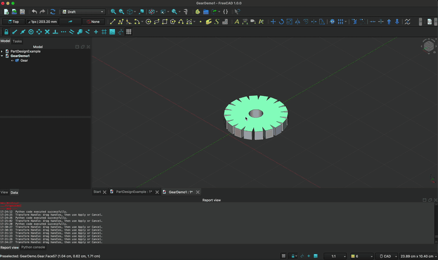

# Transform Handle

An experimental FreeCAD addon that brings a direct-manipulation transform
handle to the 3D view: a Blender-inspired X/Y/Z arrow-and-ring gizmo at the
pivot, where each arrow and ring is its own Coin3D dragger, so a drag is
constrained to the axis you grabbed.



It registers commands rather than a workbench, so the handle is available from
whichever workbench you are already modelling in.

## Status

This is a deliberately conservative first pass. It is intended for FreeCAD
1.0+ and is implemented entirely in Python.

* Ordinary objects and `App::Part` containers: their `Placement` is changed.
* Part Design features: the owning `PartDesign::Body` is transformed instead
  of a history feature.
* Attached BIM/Arch objects: their `AttachmentOffset` is changed, preserving
  the host/support relationship.
* `App::Link` objects: the link placement is changed; the linked source is
  never edited.
* Multi-selection: targets are deduplicated and transformed about one shared
  bounding-box centre.
* Each arrow and ring is its own Coin dragger, so a drag is constrained to the
  axis you grabbed: `SoTranslate1Dragger` per axis for the arrows,
  `SoRotateDiscDragger` per axis for the rings.
* Scaling is not currently reachable from the handle. It needs an
  `SoScale1Dragger` per axis; `_apply_scale` is still there for that. The rule
  it enforces stands: only objects exposing a writable `Scale`/`ScaleFactor`
  can be scaled, and the addon never bakes a scale into a Shape or edits a
  feature's dimensions behind the user's back.

That last rule is important: transform matrices can represent scale, but a
FreeCAD `Placement` cannot. A future version needs workbench-specific scale
adapters (for example, a wall's length/height/width) before it can claim safe
universal scaling.

## Install for development

FreeCAD loads workbenches from its user Mod directory. Symlink this checkout,
then restart FreeCAD:

```bash
mkdir -p "$HOME/Library/Application Support/FreeCAD/Mod"
ln -s /usr/local/src/freecad-transformer-plugin/MoveWidget \
  "$HOME/Library/Application Support/FreeCAD/Mod/MoveWidget"
```

## Usage

This addon registers commands rather than a workbench, so the handle is
available from whichever workbench you are already modelling in. Transforming
an object should not cost you the PartDesign or BIM toolbars you were just
using.

After restarting, bind the commands under **Tools → Customize**. They appear
under the category **MoveWidget** — for Python commands FreeCAD takes that
label from the `Mod` directory name, not from anything the addon declares, so
a `GroupName` resource has no effect.

* **Keyboard** tab — assign a shortcut to *Toggle handle*. This is the
  Blender-like flow: select, press the key, drag.
* **Toolbars** tab — add the three commands to a custom toolbar, which stays
  visible across workbenches.

Then select objects and run **Toggle handle**. Use **Apply** to retain changes
or **Cancel** to restore the exact pre-drag state.

## Architecture

`MoveWidget/transform_controller.py` separates selection-to-target resolution
from viewport interaction. That makes it practical to add adapters for BIM
objects, assemblies, and additional parametric types without touching the
Coin3D handle code.

## License

LGPL-2.1-or-later.
